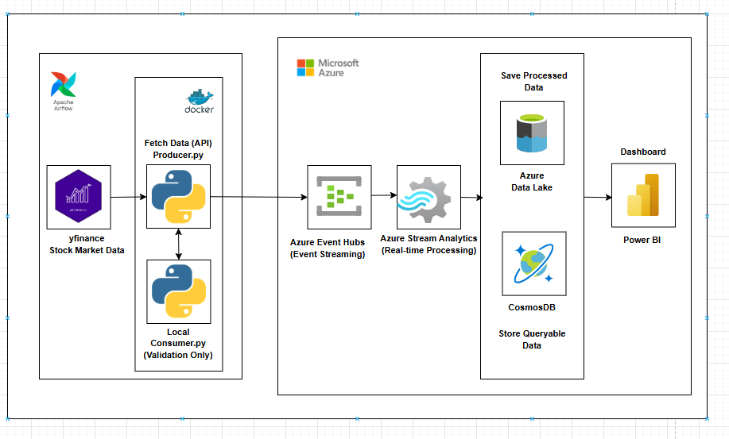
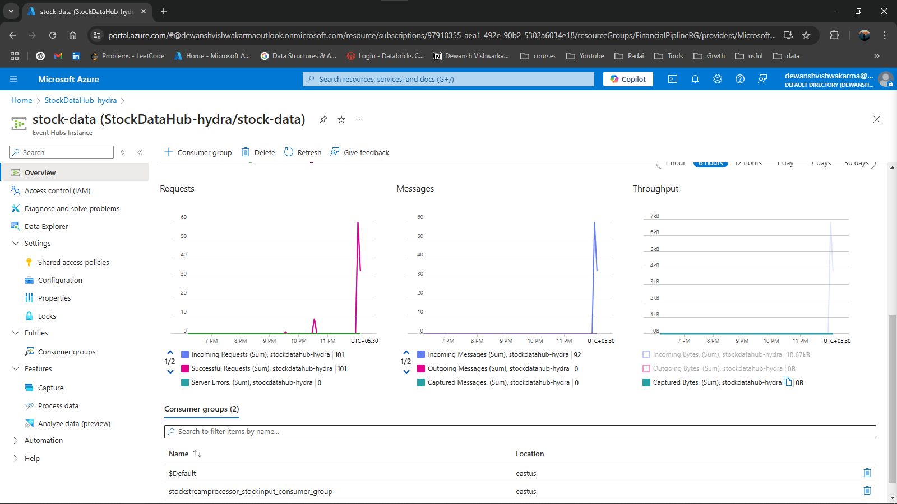
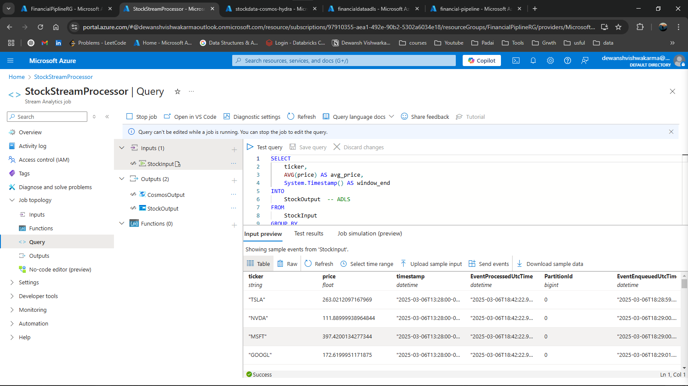
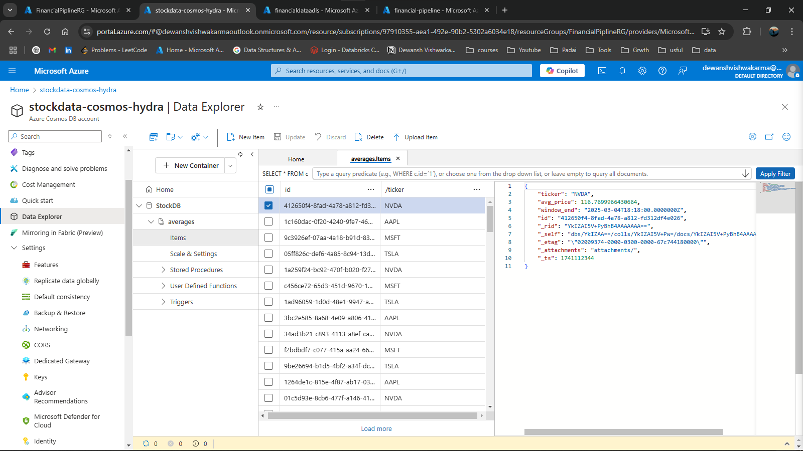
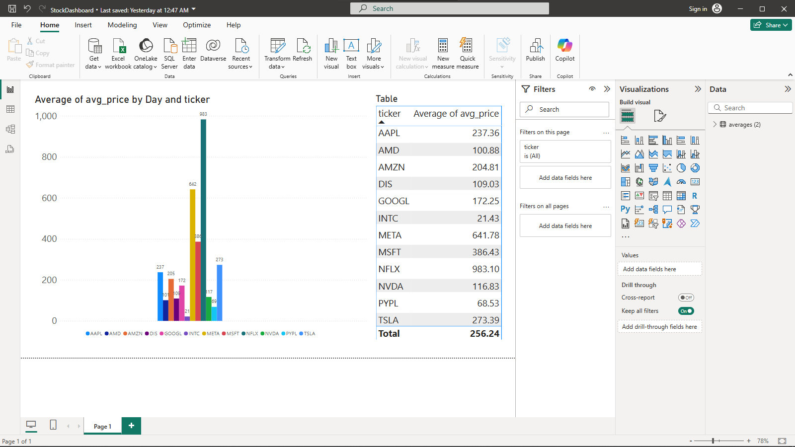

# Real-Time Financial Market Data Pipeline

## Overview
Overview
This project builds a real-time financial market data pipeline to fetch, process, and analyze stock market data using Azure services and visualize it in Power BI.

Key Features
* Live Data Streaming: Fetches stock market data using the Yahoo Finance API and streams it via Azure Event Hub.
* Real-Time Processing: Azure Stream Analytics processes incoming data for analysis.
* Cloud Storage & Querying: Processed data is stored in Azure Data Lake Storage (ADLS) and CosmosDB for structured querying.
* Insights & Visualization: Power BI provides real-time dashboards for financial market trends.
* Automation & Orchestration: Apache Airflow automates and schedules pipeline tasks.
* Containerized Deployment: The entire setup is Dockerized for easy deployment and scalability.


## Architecture




1. **Data Ingestion:** Stock data is fetched from Yahoo Finance using Python.
2. **Streaming:** Data is streamed using Azure Event Hub (Kafka not used in final implementation).
3. **Processing:** Azure Stream Analytics processes incoming data.
4. **Storage:** Processed data is stored in Azure Data Lake Storage (ADLS) and CosmosDB.
5. **Visualization:** Power BI is used for real-time insights.
6. **Orchestration:** Apache Airflow manages the data pipeline workflow.
7. **Containerization:** The entire setup is containerized using Docker.

## Tech Stack
- Python
- Azure Event Hub
- Azure Stream Analytics
- Azure Data Lake Storage (ADLS)
- CosmosDB
- Power BI
- Apache Airflow
- Docker
- Git

## Setup Instructions
### Prerequisites
- Docker installed
- Azure account with Event Hub, Stream Analytics, ADLS, and CosmosDB configured

### Steps
1. Clone the repository:
   ```sh
   gh repo clone DewanshVk/Financial-Market-Data-Pipeline-
   cd Financial-Market-Data-Pipeline-
   ```
2. Start Event Hub setup (modify config as needed).
3. Deploy the Stream Analytics job in Azure.
4. Run the producer to fetch and stream stock data:
   ```sh
   python src/producer/producer.py
   ```
5. Run the consumer to receive and store data:
   ```sh
   python src/test_consumer/consumer.py
   ```
6. Use Power BI to connect to CosmosDB and visualize data.

## Screenshots
Visual representations of key components are located in the `screenshots/` directory:
- Azure Event Hubs
   
   

- Azure Stream Analytics
   
   

- Azure Cosmos 

   

- Power BI Dashboard
  

- Apache Airflow UI

 

## Contribution
Feel free to fork the repo and submit a PR with improvements!

## License
MIT License
